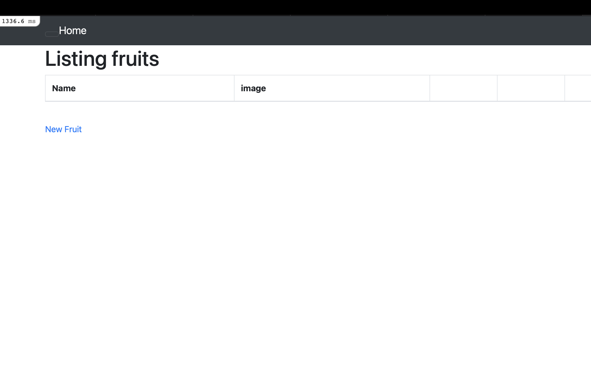

# 第3回課題

## サンプルアプリケーション起動

## APサーバーについて調べる

* APサーバーの名前とバージョンを確認してみましょう。  
  名前　Puma , バージョン　6.4.2  

* APサーバーを終了させた場合、引き続きアクセスできますか？  
  できません。 

## DBサーバーについて調べる

* サンプルアプリケーションで使ったDBサーバーの名前とバージョンはいくつか確認
してみましょう。  
  名前　MySQL , バージョン　8.4.4

* DBサーバーを終了させた場合、引き続きアクセスできますか？  
  できません。

* Railsの構成管理ツールの名前は何でしたか？  
  Bundler

## 今回の課題から学んだこと、感じたこと
* 第3回の課題は今までの課題に比べて格段に難しいと感じたので  
とても大変でしたが、その分達成感がありました。
* 第2回の課題の復習にもなりこれからも繰り返し勉強して  
たくさんのこと学んで吸収していきたいと思います。

