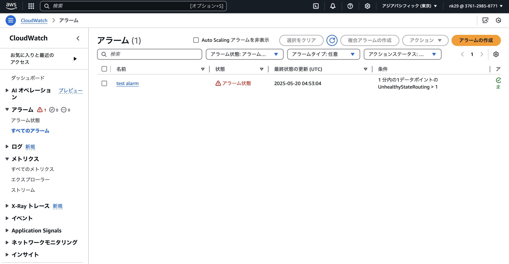

# 第6回課題

## CloudTrailのイベント

### イベント名
* StopInstances(インスタンス停止)

### イベント時間
* 2025年5月15日 19:25:46
### ユーザー名
* nk29
### 参照されたリソース（対象インスタンス）
* i-0bbe172f4bc82381c
### イベントレコード

## CloudWatchアラームを使ってALBの設定

### アラームを作成
メトリクス名(UnhealthyStateRouting)
* Railsアプリケーションが使えない時:アラーム状態のステータス

* Railsアプリケーションが使える時:OKのステータス

### Amazon SNSでメール通知設定
* 「ALARM」

* 「OK」

## AWS利用料の見積もり作成
https://calculator.aws/#/estimate?id=3ae0c1840420e9e5b7f842182cae6f4473dfac01

### 今月までのAWSの利用料
* 合計コスト $106.01
* 使ってないVPCやEC2インスタンスは削除したり、Elastic IPを解放するなど対策していかないといけないと思った。

